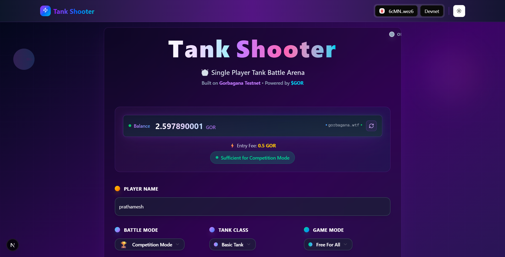
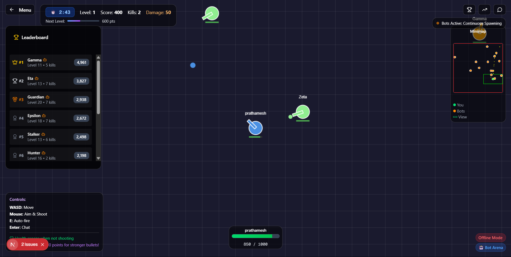

# 🎮 Tank Shooter - Multiplayer Battle Arena on Gorbagana Chain

[](https://gorbagana.wtf)
[](https://nextjs.org)
[](https://gorbagana.wtf)
[](https://github.com)
[](https://github.com)

**An epic multiplayer tank warfare game built on the Gorbagana blockchain, featuring real-time PvP battles, tournament competitions with GOR prizes, advanced AI opponents, and seamless Web3 integration with sub-second finality.**


## 🌟 Game Overview

Tank Shooter is a fast-paced multiplayer battle arena that showcases the power of Gorbagana's sub-second finality through engaging real-time gameplay. Command your tank, battle opponents, and compete for GOR prizes in this blockchain-powered gaming experience that combines classic arcade action with cutting-edge Web3 technology.

### 🎯 Core Features

- **🚀 Real-time Multiplayer Combat** - Instant battles with sub-second blockchain transactions
- **🏆 Competition Mode** - Tournament-style battles with 0.5 GOR entry, 1 GOR prize pool
- **🤖 Advanced AI Arena** - Practice against intelligent bots with multiple difficulty levels
- **🎨 4 Unique Tank Classes** - Each with distinct weapons, abilities, and playstyles
- **🌐 Multiple Game Modes** - Free For All, Team Deathmatch, Competition, and Training
- **🔊 Immersive Audio System** - Complete sound effects, background music, and spatial audio
- **💰 Blockchain Rewards** - Real GOR token prizes and transparent on-chain gameplay
- **📱 Modern UI/UX** - Responsive design with dark theme and smooth animations
- **⚡ WebSocket Multiplayer** - Real-time synchronization for up to 10 players per room
- **🎭 Spectator Mode** - Watch ongoing competitions after elimination

### 🎮 Game Modes & Pricing

| Mode | Description | Entry Fee | Max Players | Prize Pool |
|------|-------------|-----------|-------------|------------|
| **🏆 Competition** | Tournament with GOR prize | 0.5 GOR | 8 players | 1 GOR |
| **🌐 Multiplayer** | Real-time PvP battles | 0.001 GOR | 10 per room | None |
| **🤖 Bot Arena** | Practice vs AI opponents | 0.001 GOR | 1 + 15 bots | None |
| **⚡ Auto Select** | Smart mode switching | 0.001 GOR | Variable | None |

### 🔫 Tank Classes & Abilities

| Class | Weapon System | Special Ability | Damage | Rate of Fire | Best For |
|-------|---------------|-----------------|---------|--------------|----------|
| **Basic** | Balanced cannon | Well-rounded stats | Medium | Medium | Beginners |
| **Twin** | Dual cannons | Higher DPS | Medium | Fast | Aggressive play |
| **Sniper** | Long-range rifle | High damage shots | High | Slow | Precision players |
| **Machine Gun** | Rapid fire | Volume of fire | Low | Very Fast | Close combat |

## 🌐 Gorbagana Integration

### Blockchain Features

- **⚡ Sub-second Finality** - Instant transaction confirmation for smooth gameplay
- **💎 Native GOR Token** - All fees paid in Gorbagana's native token
- **🔐 Secure Payments** - Blockchain-verified entry fees and prize distribution
- **📊 Transparent Economy** - All transactions visible on-chain
- **🎯 Fair Competition** - Equal player stats in competition mode

### Network Details

- **Network**: Gorbagana Testnet
- **RPC Endpoint**: `https://rpc.gorbagana.wtf/`
- **Explorer**: [explorer.gorbagana.wtf](https://explorer.gorbagana.wtf/)
- **Status**: [status.gorbagana.wtf](https://status.gorbagana.wtf/)
- **Faucet**: [faucet.gorbagana.wtf](https://faucet.gorbagana.wtf/)

### Supported Wallets

- **Primary**: [Backpack Wallet](https://backpack.app/) (Required)
- **Configuration**: Custom RPC setup for Gorbagana testnet

## 🚀 Quick Start

### Prerequisites

1. **Install Backpack Wallet**

   ```bash
   # Visit https://backpack.app/ and install the browser extension
   ```

2. **Configure Gorbagana Network**
   - Open Backpack wallet settings
   - Add custom RPC: `https://rpc.gorbagana.wtf/`
   - Switch to Gorbagana testnet

3. **Get Test GOR Tokens**
   - Visit [faucet.gorbagana.wtf](https://faucet.gorbagana.wtf/)
   - Request 1-100 GOR (once per 24 hours)

### 🎮 Playing the Game

1. **Connect Wallet** - Link your Backpack wallet to the game
2. **Choose Your Name** - Enter your tank commander identity
3. **Select Battle Mode** - Pick from Competition, Multiplayer, or Training
4. **Choose Tank Class** - Select your preferred fighting style
5. **Pay Entry Fee** - Confirm the GOR transaction
6. **Battle!** - Use WASD to move, mouse to aim and shoot

### 🎯 Controls

| Input | Action |
|-------|--------|
| **WASD** | Move tank |
| **Mouse** | Aim and shoot |
| **E** | Toggle auto-fire |
| **Enter** | Open chat |

## 🛠 Local Development

### Installation

```bash
# Clone the repository
git clone https://github.com/Prathamesh-Chougale-17/tankshooter.git
cd tankshooter

# Install dependencies
pnpm install

# Start development server
pnpm dev

# In another terminal, start the WebSocket server
pnpm server:dev
```

### Environment Setup

1. **Development Server**: `http://localhost:3000`
2. **WebSocket Server**: `ws://localhost:8080`
3. **Production**: Deploy to your preferred hosting platform

### 📁 Project Structure

```text
tankshooter/
├── app/                    # Next.js app directory
├── components/            # React components
│   ├── ui/               # UI components (buttons, cards, etc.)
│   ├── game-canvas.tsx   # Main game component
│   ├── game-menu.tsx     # Game menu interface
│   └── sound-control-panel.tsx  # Audio controls
├── lib/                   # Core game logic
│   ├── game-engine.ts    # Game mechanics and physics
│   ├── gas-payment.ts    # Blockchain payment handling
│   └── sound-manager.ts  # Audio system
├── hooks/                 # React hooks
├── public/               # Static assets
│   └── sounds/          # Audio files
└── server.ts            # WebSocket multiplayer server
```

## 🔧 Technical Architecture

### Frontend Stack

- **Framework**: Next.js 15 with TypeScript
- **Styling**: Tailwind CSS with custom animations
- **UI Library**: Radix UI components
- **State Management**: React hooks and Context
- **Audio**: Web Audio API with custom sound manager

### Blockchain Integration

- **Network**: Gorbagana Testnet (Solana-based)
- **Wallet**: @wallet-ui/react for Backpack integration
- **Payments**: Custom gas payment system for GOR tokens
- **RPC**: Direct integration with Gorbagana RPC endpoint

### Game Engine

- **Rendering**: HTML5 Canvas with 60fps gameplay
- **Physics**: Custom collision detection and movement
- **Networking**: WebSocket for real-time multiplayer
- **Audio**: Comprehensive sound system with spatial audio

### Multiplayer Server

- **Protocol**: WebSocket (ws://)
- **Features**: Real-time player sync, chat, leaderboards
- **Scalability**: Supports multiple concurrent battles
- **Bot AI**: Intelligent computer opponents with difficulty levels

## 🔊 Audio System

### Sound Effects

- **Combat**: Shooting, explosions, hits, reloads
- **Movement**: Engine sounds, tank movement
- **UI**: Button clicks, level ups, achievements
- **Ambient**: Background music, environmental sounds

### Audio Controls

- **Master Volume**: Overall audio level
- **Music Volume**: Background music control
- **SFX Volume**: Sound effects level
- **Mute Toggle**: Quick audio disable
- **Test Sounds**: Preview audio effects

## 🏆 Competition Mode

### Tournament Rules

- **Entry Fee**: 0.5 GOR per player
- **Prize Pool**: 1 GOR (winner takes all)
- **Players**: Exactly 8 participants
- **Duration**: 3-minute battles
- **Victory Condition**: Most kills (minimum 1 to qualify)

### Fair Play Features

- **Equal Stats**: All players have identical tank capabilities
- **Standardized Health**: Same health pool for all participants
- **Level Playing Field**: No upgrades or advantages
- **Spectator Mode**: Watch matches after elimination

## 📱 Demo & Access

### Live Demo

- **URL**: [Live Demo](https://tankshooter-seven.vercel.app)
- **Requirements**: Backpack wallet with GOR tokens
- **Supported Browsers**: Chrome, Firefox, Safari, Edge

### Screenshots



## 🔧 Advanced Features

### � AI System

- **Three Difficulty Levels**: Easy, Medium, and Hard bots with distinct behaviors
- **Smart Targeting**: Bots intelligently select targets and use tactical movement
- **Dynamic Spawning**: Continuous bot spawning with difficulty scaling
- **Competition Bots**: Specialized hard-difficulty bots for tournament mode
- **Collision Avoidance**: Advanced pathfinding and boundary detection
- **Health Regeneration**: Automatic health recovery for sustained battles

### 🎵 Audio System

Tank Shooter features a comprehensive audio system built with Web Audio API:

#### Sound Categories

- **Combat Sounds**: Shooting, explosions, hits, reloads, metal impacts
- **Movement Audio**: Engine start/stop, idle sounds, tank movement
- **UI Feedback**: Button clicks, level up notifications, achievements
- **Competition Audio**: Countdown timers, time warnings, victory sounds

#### Volume Controls

- **Master Volume**: Overall audio level control
- **Music Volume**: Separate background music control  
- **SFX Volume**: Independent sound effects volume
- **Mute Toggle**: Quick audio disable/enable
- **Persistent Settings**: Audio preferences saved to localStorage
- **Test Sounds**: Preview system for all sound effects

#### Implementation Features

- **Client-side Only**: SSR-safe implementation for Next.js
- **Spatial Audio**: Positional audio for immersive gameplay
- **Dynamic Loading**: Lazy loading of audio assets
- **Error Handling**: Graceful fallbacks for audio failures
- **Browser Compatibility**: Works across modern browsers

### 🌐 Multiplayer Architecture

#### WebSocket Server Features

- **Real-time Synchronization**: 60fps player and bullet updates
- **Room Management**: Automatic room creation and cleanup
- **Player State**: Position, rotation, health, score synchronization
- **Chat System**: In-game messaging with player identification
- **Scalability**: Supports multiple concurrent rooms (10 players each)
- **Cleanup**: Automatic removal of inactive players and rooms

#### Client Features

- **Connection Management**: Automatic reconnection and fallback handling
- **State Prediction**: Client-side prediction for smooth gameplay
- **Lag Compensation**: Network optimization for responsive controls
- **Visual Indicators**: Connection status and player count displays

### 🏆 Competition System

#### Tournament Mechanics

- **Fixed Player Count**: Exactly 8 participants (1 human + 7 bots)
- **Equal Stats**: All players start with identical health and abilities
- **No Respawning**: Eliminated players/bots stay out of the match
- **Time Limit**: 3-minute matches with countdown timer
- **Win Conditions**: Most kills wins (minimum 1 kill to qualify)
- **Tiebreaker**: First to reach kill count wins in case of tie

#### Prize Distribution

- **Entry Fee**: 0.5 GOR per participant
- **Prize Pool**: 1 GOR for the winner
- **Qualification**: Must have at least 1 kill and be the winner
- **Prize Claiming**: Automated GOR token transfer to winner's wallet
- **Spectator Mode**: Eliminated players can watch the remaining match

#### Prize System

- **Native GOR Transfers**: Direct wallet-to-wallet transactions
- **Transaction Verification**: On-chain confirmation of all payments
- **Explorer Links**: Direct links to transaction details
- **Error Handling**: Comprehensive failure recovery and user feedback

## 🚀 Deployment & Production

### 📦 Production Deployment

#### Environment Variables Required

```bash
# Blockchain Configuration
GORBAGANA_RPC_URL=https://rpc.gorbagana.wtf
GORBAGANA_PRIVATE_KEY=your_server_wallet_private_key_base58

# Optional Configuration  
DEBUG_MODE=false
PORT=3001
```

#### Build and Deploy

```bash
# Production build
pnpm build

# Start production server
pnpm start

# Start WebSocket server (separate process)
pnpm server
```

#### Deployment Platforms

- **Vercel**: Recommended for Next.js frontend
- **Railway/Render**: For WebSocket server hosting
- **Docker**: Container deployment available

### 🔧 Development Commands

```bash
# Development
pnpm dev          # Start Next.js development server
pnpm server:dev   # Start WebSocket server with hot reload

# Production
pnpm build        # Build for production
pnpm start        # Start production server
pnpm server       # Start WebSocket server

# Maintenance
pnpm lint         # Run ESLint
pnpm type-check   # TypeScript validation
```

### 🌍 Live Demo

- **Demo URL**: [Live Demo](https://tankshooter-seven.vercel.app)
- **Requirements**: Backpack wallet with GOR tokens
- **Supported Browsers**: Chrome, Firefox, Safari, Edge (WebSocket support required)

### 📸 Screenshots



### 🎮 Gameplay Videos

[Add links to gameplay videos demonstrating:

- Competition mode full match
- Multiplayer battles
- Tank class differences
- Sound effects and UI features]

## 🤝 Contributing

We welcome contributions from the community! Here's how you can help:

### 🛠 Development Guidelines

1. **Fork the repository** and create a feature branch
2. **Follow the code style** using ESLint and Prettier
3. **Add tests** for new features when applicable
4. **Update documentation** for any new functionality
5. **Submit a pull request** with a clear description

### 🎯 Areas for Contribution

- **New Tank Classes**: Design unique weapons and abilities
- **Game Modes**: Create innovative battle scenarios  
- **UI/UX Improvements**: Enhance the player experience
- **Audio Content**: Add new sound effects and music
- **Performance Optimization**: Improve game engine efficiency
- **Bug Fixes**: Help resolve issues and improve stability

### 🔄 Development Workflow

```bash
# Fork and clone the repository
git clone https://github.com/Prathamesh-Chougale-17/tankshooter.git
cd tankshooter

# Install dependencies
pnpm install

# Create a feature branch
git checkout -b feature/your-feature-name

# Make your changes and test
pnpm dev
pnpm lint

# Commit and push your changes
git commit -m "Add your feature description"
git push origin feature/your-feature-name

# Create a pull request
```

## 📄 License

This project is open source and available under the [MIT License](LICENSE).

## 🙏 Acknowledgments

### 🌟 Special Thanks

- **Gorbagana Team** - For the incredible testnet infrastructure and blockchain technology
- **Backpack Wallet** - For seamless Web3 wallet integration and user experience
- **Next.js Team** - For the amazing React framework and development tools
- **Open Source Community** - For the libraries, tools, and inspiration that made this possible

### 🛠 Technology Stack

- **Frontend**: Next.js 15, TypeScript, Tailwind CSS, Radix UI
- **Audio**: Web Audio API with custom sound manager
- **Blockchain**: Gorbagana Web3.js SDK, Gill Solana client
- **Multiplayer**: WebSocket with custom room management
- **UI Components**: shadcn/ui with custom tank warfare theme
- **Development**: ESLint, Prettier, pnpm, Git

### 🎮 Inspiration

Tank Shooter draws inspiration from classic tank battle games while bringing them into the Web3 era with:

- Modern blockchain integration
- Real-time multiplayer capabilities  
- Tournament-style competitions
- Immersive audio-visual experience
- Community-driven gameplay

---

## Built with 💜 for the Gorbagana Community

Ready to dominate the battlefield? Connect your wallet and join the battle! 🚀

### 🔗 Quick Links

- [Live Demo](https://tankshooter-seven.vercel.app) - Play Tank Shooter now!
- [Gorbagana Explorer](https://explorer.gorbagana.wtf/) - View transactions
- [Gorbagana Faucet](https://faucet.gorbagana.wtf/) - Get test GOR tokens
- [Backpack Wallet](https://backpack.app/) - Download the wallet
- [Documentation](./docs/) - Detailed guides and API reference

*Join our community and stay updated with the latest Tank Shooter news and tournaments!*
